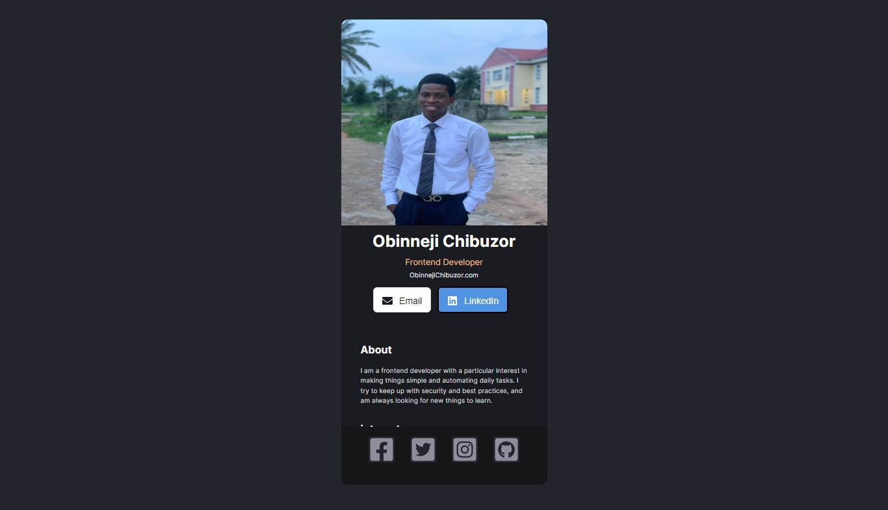

# My Digital Card

This is a single page digital card created with ReactJs. understanding of Components and styling in react is was the aim of creating this car

## Table of contents

- [Overview](#overview)
- [Screenshot](#Screenshot)

  - [Links](#links)
- [My process](#my-process)
  - [Built with](#built-with)
  
- [Author](#author)

## Overview
This card diaplays information of the user(chibuzor) which include
- Image and Role
- user linkedin and emial contact
- About user
- users intrest
- user social media address

## Screenshot

### Links

- Solution URL: [Github Repository](https://github.com/obinneji/Digital-Card/)
- Live Site URL: [Digital Card](https://digital-card-lime.vercel.app/)

## My process
- Created a react App
-Created four different components for various section 
- styling of the page with css3
- Icons from fontAwesome

### Built with

- Semantic HTML5 markup
- CSS custom properties
- Flexbox
- Javascript
- ReactJS

## Author

- Frontend Mentor - [obinneji](https://www.frontendmentor.io/profile/obinneji)
- Twitter - [Obinneji Francis](https://www.twitter.com/francisobinneji)
- Linkedin-[Obinneji Chibuzor](https://www.linkedin.com/obinneji/)

